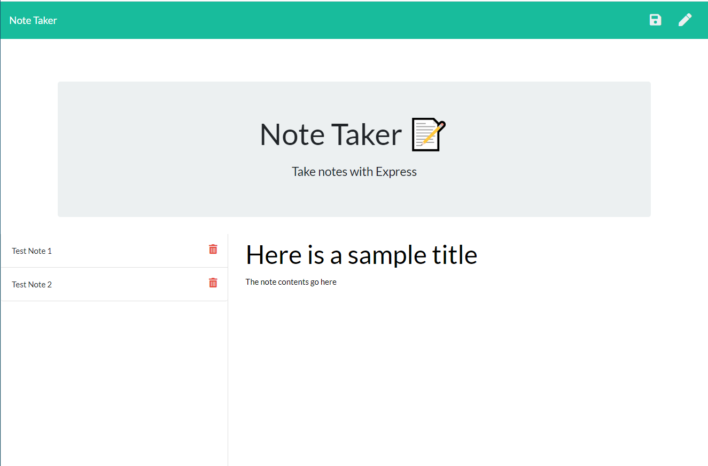

# Express-Note-Taker

## Description 

Express Note Taker is a handy app to quickly and easily write, save and delete short text notes.

For users that need to keep track of a lot of information, it's easy to forget or be unable to recall something important. Being able to take persistent notes allows users to have written information available when needed.

* [Github Repository](https://github.com/kirsralk/Express-Note-Taker).
* [Heroku Deployment](https://agile-everglades-86564.herokuapp.com/).
* App Screenshot:

## User Story

AS A user, I want to be able to write and save notes

I WANT to be able to delete notes I've written before

SO THAT I can organize my thoughts and keep track of tasks I need to complete

## Installation

This app runs on Heroku, use it in your browser or download the Github repo to create a local version on your localhost.

## Usage 

* From the home screen, click on "Get Started" to get started!

* Create a new note by clicking the pencil icon 

* Store your active note to your saved notes by clicking the save icon at the top right of the screen
    * Note: this icon only appears if you have entered a Title and Text for your note

* Delete a previous note by clicking the trash can next to it in the left-hand store notes column

## Credits

Created by Kirsi: https://github.com/kirsralk/

## License

